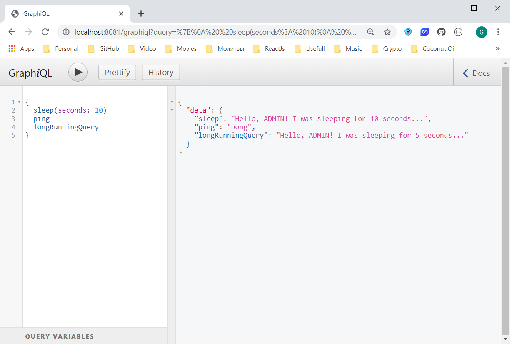

# Asynchronous GraphQL Java Query Execution Demo

This repository contains configuration [`GraphQLAsyncConfig`](./src/main/java/lv/gennadyyonov/graphqlasync/config/GraphQLAsyncConfig.java) to enable GraphQL Query asynchronous execution.

Basically, it is responsible to propagate the following information to the newly created async thread:

- Security Context
- Log Correlation Information:
  
  - Open Tracing Context
  - Custom MDC Context.

## Required Software

### Java

- JDK 1.8

### Lombok

#### IntelliJ 

- Download and install Lombok [plugin](https://plugins.jetbrains.com/plugin/6317-lombok-plugin)
- Enable Annotation Processors
  -  Go to **Setting > Build, Execution, Deployment > Compiler > Annotation Processors**
  -  Check _Enable annotation processing_
  
### Build Automation Software

[Gradle](https://gradle.org/) is used as a build automation tool. 
Several major IDEs allow you to import Gradle builds and interact with them.
IntelliJ IDEA supports a fully-functional integration with Gradle.

## Build Project

`$ gradlew clean build`

## Run Application on localhost

`$ gradlew clean bootRun`

Application will be running on port `8081` by default, see [`application.yml`](./src/main/resources/application.yml).

It's API can be accessed via [GraphiQL](http://localhost:8081/graphiql) in your browser.

If you see Basic Auth browser pop-up then things are working!

Use the following credentials, see [`SecurityConfig#configureGlobal(AuthenticationManagerBuilder)`](./src/main/java/lv/gennadyyonov/graphqlasync/config/SecurityConfig.java):
```
Username: admin
Password: password
```



## Tech Stack
- [Spring Boot](https://projects.spring.io/spring-boot/) : Application framework
- [Spring Cloud Sleuth](https://github.com/spring-cloud/spring-cloud-sleuth) : Distributed tracing tool for Spring Cloud
- [Lombok](https://projectlombok.org/features/index.html) : Utility library for Java language
- [GraphQL](http://graphql.org/learn/) : API query runtime
  - [GraphQL and GraphiQL Spring Framework Boot Starters](https://github.com/graphql-java/graphql-spring-boot)
  - [GraphQL Java Tools](https:g//github.com/graphql-java/graphql-java-tools)
